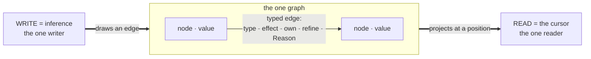

# mentl edit — the interaction architecture

> *The cursor, felt.*
>
> Sibling to `DESIGN_SYSTEM.md`, which owns the brand, the tokens, and the
> visual language; read it first, because this document assumes it. That brief
> answers how Mentl looks. This one answers the prior question: what is an IDE
> when the program is a graph, text is one projection among many, and the
> compiler is the intelligence? It is the design artifact of the felt aspect
> (PLAN §5.2, band M), not read-path. Interrogate it; do not absorb it.
>
> How to read the tags. Ground rule 1 of this design: no view earns a place
> unless it names *which cursor mode* it runs in (PLAN §2's subsystem table) and
> *which of the eight aspects* it projects. Every surface below carries that tag
> in the form *(cursor mode · aspect)*. The eight aspects are one octagonal
> identity read two ways, the kernel primitive and its tentacle sense:
>
> `graph·query` · `handler·propose` · `verb·topology` · `row·unlock` ·
> `ownership·trace` · `refinement·verify` · `gradient·teach` · `reason·why`.

---

## 0 · The thesis

Every IDE ever built is an application wrapped around a text buffer: panels
*about* the code, a compiler *behind* the code, an assistant *beside* the code.
mentl edit inverts this once, cleanly. **The IDE is the program's own
self-projection, pointed at a human.** There is one graph. Inference is its one
writer. The cursor is its one reader. Everything on screen (the text, the
topology lines, the row matrix, the Why chain, the proposals) is that single
read at a different altitude, and every one is *live*, because re-projection on
graph delta is the same machinery as incremental compilation (§4⑦: reactivity
IS the cursor's `<~`).

The consequence that governs every decision below: **panels are not features;
panels are cursor modes.** Click anything in any projection and the cursor
moves; every other projection re-projects around it. One attention point, N
altitudes, zero synchronization code, because the graph is the synchronization.

**The felt loop is the center; design around it, not around files:**

```
type            →  the buffer takes a keystroke
project          →  the graph updates; every surface re-derives (the IC cursor's <~)
propose          →  the gradient reads the ?? socket; the medium fans proven survivors
accept           →  Tab draws a patch edge; the loop re-projects around it
```

That loop is the whole product. Files are a serialization of the graph, not the
mental model; the loop is where a person lives.

And the closing move, the one that makes the design future-proof rather than
merely good: **mentl edit is itself a Mentl program**, the loop SYNTAX.md writes
in its own composition sketch.

```
keystroke
  |> tokenize
  |> parse_to_graph
  ~> format_default
  ~> render_to_transport
    <~ accumulate(graph)
```

The IDE has no outside either. There is no plugin API, because **the language is
the plugin API**: a theme is a `Render` handler, a keybinding is a handler on
the `Input` effect, a custom pane is a projection function, a "linter" is a
handler on `Verify`. Extending the IDE and writing Mentl are one act, so every
extension is proven under the same rows as everything else, so a plugin cannot
reach the network unseen (`!Network` is checkable) and cannot lie about what it
touches. VS
Code's extension market is a trust problem; mentl edit's is a theorem.

---

## 1 · The essence — a lens you look through

Hold the whole design to one sentence. **You should look *through* mentl edit at
your program, never *at* mentl edit.** The program is visible; the language is
invisible. When it works, a developer forgets the medium is there the way you
forget a clean window is there, and sees only what is on the far side: their
computation, its shape, its promises, and the one place it is waiting for them.

That feeling is not a mood to chase with polish. It is guaranteed, or broken, by
four invariants. Every surface, interaction, and portrait in this document earns
its place by obeying all four.

1. **Every pixel is a live read.** No surface caches a fact the graph holds;
   nothing on screen is re-derived from a stale copy. If a display and the graph
   disagree, the display is the bug, not a lag to tolerate. This is the
   Carried-Truth Law at the surface: the moment a panel keeps its own model of
   the program, you are looking *at* a second thing instead of *through* at the
   one graph.

2. **One attention, every altitude.** There is one cursor. Click any fact in any
   surface and the cursor moves there; every other surface re-projects around
   it. No panel owns state; no synchronization code exists. The window is one
   pane of glass, not a wall of monitors you keep in sync by hand.

3. **The shape is the meaning.** Layout is the formatter's projection of the
   topology, never something you type. The five verbs draw the program's form on
   the page, and the page defends that form (topology resist). You read the
   computation graph directly off the indentation, so the notation stops being a
   thing to parse and becomes the thing itself.

4. **Silence is the default; proof is the only reason to speak.** The medium
   surfaces one proven thing or nothing at all (voice.mn's `silence_predicate`
   reads the oracle queue; empty queue, full silence). Errors are sockets, not
   scoldings. You never meet "the compiler" as a character; you meet your
   program and the places it needs you.

The test for any new idea: does it let the developer see *more of their program*
and *less of Mentl*? If it adds a thing to look at, it fails, however pretty.

---

## 2 · What dissolves — the anti-IDE

Ultimate form is mostly subtraction. Each fixture of IDE-land is a workaround for
a missing kernel fact; Mentl has the fact, so the fixture dissolves.

| IDE fixture | The missing fact it papered over | What replaces it |
|---|---|---|
| **Files & the file tree** | no unit of meaning smaller than a file | Modules are graph regions; the "tree" is one projection query among many (by module, by effect, by owner, by recency-of-Reason). Text files remain the durable *serialization*, not the mental model. |
| **Save** | the program only exists when flushed | The image persists continuously (the bump image + trail; persist is memcpy, §4④). "Unsaved changes" is not a state that exists. Checkpoint replaces save: a *named* moment, not a rescue. |
| **The Run button** | the program is dead until invoked | The program is *live while you write it* (§3.7: the hole is a dormant continuation). "Run" is installing a handler at `main`, one more `~>`. |
| **The error list** | diagnostics as a flat queue | The gradient's **one** next thing that matters most (Teach), plus sockets *in place*. A hundred-item Problems panel is attention-DDoS; the medium ranks, so the human never triages. |
| **Breakpoints & the debugger** | no first-class suspension | A hole **is** a breakpoint, a dormant continuation carrying its live value. Debugging is editing at a suspension point; time-travel is the forked cursor scrubbing the trail (band B). One mechanism, not a second product. |
| **Text search / go-to-definition** | the graph existed only in the compiler's head | Graph query: find by *edge*, not by string. "Every consumer of this row," "every `own` crossing this boundary," "everything this Reason justified." Definition, references, and rename are one edge-walk (`lsp.mn`'s `handle_definition` / `handle_references` already do the walk). |
| **Diff review** | changes as line edits | Changes as *proof-obligation deltas*: which rows widened, which refinements gained obligations, which `!E` claim a change would break. The diff of what is *promised*, above the diff of what is written. In the machine-code age this is the load-bearing surface: when no human authored it, "looks right" is worthless and the proofs are the review (PLAN §0). |
| **The AI chat panel** | generation without verification | The socket: proposals are multi-shot candidates that *survived checkpoint → infer → Verify → rollback* before you ever see one. No prompt box, no transcript, no apology. The unit of conversation is the constraint, not the token (PLAN §1). |
| **Plugin marketplace** | the tool can't express its own extensions | Handlers (§0). |
| **Settings JSON** | configuration outside the medium | Config is handler *state*: inspectable, typed, `mentl why`-able like everything else. |

The rule behind the table: **if a surface exists because text-as-truth lost
information, delete the surface and read the graph.** The Carried-Truth Law,
applied to UI.

---

## 3 · The live surface — the editing loop's ultimate form

This is the surface you *write into*. It is not more true than the graph views
of §4, only more writable. Everything here is a reading of the one cursor; the
Teach knob (DESIGN_SYSTEM §9) is the single density control, so the interface's
information volume scales with what is *proven*, never with what is *configured*.

### 3.1 · The loop, on the page

*(proposing cursor · gradient·teach, the whole ring)*

You type into free text. The parser is productive-under-error, so a half-typed
arm never kills the rest of the graph; everything outside the in-flight edit
keeps projecting. A keystroke parses to a graph delta; inference (the one
writer) integrates it; the trail records it. Undo is trail-walk, so undo works
*across projections*: undoing a change you made by dragging a topology edge and
one you made by typing are the same operation in the same history.

The whole loop is authored today in `cursor_transport.mn` (`cursor_session` /
`cursor_step`, the `<~` at the human boundary); the surfacing cadence
(real-time, idle-debounced, on-save, on-ask) is a transport handler choice, and
the kernel substrate underneath is invariant. Accept *is* a graph write:
`apply_suggestion` → `PatchWrite` → `splice_span` draws the edge and the loop
re-projects. There is no separate "apply" pathway to keep in sync.

### 3.2 · The Canvas — the formatter's projection

*(projected cursor · verb·topology)*

The Canvas is the text, center stage, and **its layout is never yours to type.**
On idle, `format_default` re-renders the canonical shape (`format.mn`:
left-edge `|>` and `~>` at `left_edge_indent = 2`, indented-center `><` and `<~`
at `indented_center = 4`). You break the verb grammar and the text *resists*:
the elastic snap-back toward canonical form (DESIGN_SYSTEM §4.5, topology
resist), because the shape on the page is the computation graph and the page
defends its own truthfulness. Faint sky lines physically connect the stages of a
`|>` / `<|` chain, so a pipeline reads as a literal diagram; a `~>` handler
renders as a soft enclosure around the chain it governs, so a capability
*visibly wraps* its scope; an `own` value carries the amber trace that drains on
consume. Format-liftable ceremony vanishes at parse (`perform`, redundant
braces, semicolons via `E_RedundantPerform` / `E_RedundantBraces`), so the
developer sees canon always and never a nag about it.

The keystroke→graph latency budget is the whole feel. The current artifact
already compiles small programs in about half a second on every keystroke with a
*fresh instantiation per compile*; the IC cursor (cached read, epoch-keyed)
turns that into millisecond re-projection of only what the delta touched. The
target is not "fast feedback." It is the **absence of a feedback moment**: the
projections are simply always current, the way a spreadsheet has no compile step.

### 3.3 · The Aspect ring — the eight arms at the cursor

*(projected cursor · all eight aspects of one read)*

The one always-on instrument. At any position, the cursor reads the graph once
and projects eight facets of that read (`cursor.mn`'s `cursor_view_of`, the
eight-arm `<|` fan; the same `CursorView` the cursor-address transport answers
with today at `main.mn`'s `cursor_at_handle`). One calm panel, eight facets,
each in its primitive's color, each a *door*: click `why` and the Why walk opens
on this chain; click `row` and the Ledger scopes to this position; click `??`
and the socket fires on the one next move. It is the hover and inspect surface,
and it is one octagonal identity, because the architecture is one: the octopus
has eight arms because the kernel has eight primitives, and Mentl Mono ligates
`??` into the octagonal socket glyph so the shape recurs at every scale.

Each facet renders under a strict provenance contract, always visible, so the
surface never dresses a guess as the compiler's graph truth: `surface` (the
page's own parse), `declared` (a `with` row read verbatim), `real` (a live
compiler read: an inferred type, a diagnostic, a debt), and `socket` (a
named-future gate that renders no value it cannot yet earn). The ring is where
invariant 4 lives or dies: eight facets, never eight alarms.

### 3.4 · The socket — the gradient's mouth

*(proposing cursor · gradient·teach + handler·propose)*

A `??` is where the medium speaks a proposal, and the *only* place it proposes;
everywhere else it answers. The socket is the gradient's mouth. When the cursor
sits on a hole, `cursor.mn`'s `propose_at` runs Synth's multi-shot over the
typed graph (the in-scope vocabulary, the live row, the refinements, the Reason
chains carrying upstream intent), and **only the proven survivors surface**, as
translucent ghost geometry at the socket, cycled with arrows, committed with
`Tab`. The proposer is guided search over the whole typed graph, pruned at every
step by the proof; it is the structural prior a token-sampler cannot have (PLAN
§1).

The signature move is the tie-break. When two survivors satisfy every *expressed*
constraint, the medium does not guess. It surfaces **the one missing
constraint** (a refinement, a type, an example) that collapses the tie, then
proposes the proven code (PLAN §5's `Hβ.felt.intent-ranker-gradient-plus-teaching`).
That is the teaching compiler: the disambiguating question is the ranker, and
naming the missing bit is one keystroke, cheaper than guessing it. A learned
code-body prior survives only as an optional last-resort `Synth` handler behind
the same gate, never the seat.

A hole is productive, never executable. Editing and checking through a `??` is
fine; compiling an executable whose reachable tree still carries an authored hole
is a refusal (`E_UnresolvedHole`, the armed gate). The socket is an invitation
in `accent/vermillion`, never a red squiggle.

### 3.5 · The Why button — a receipt on every token

*(reasoned cursor · reason·why)*

Click any fact anywhere (a type in the ring, a row entry in the Ledger, an
error's claim, a proposal's precondition) and the provenance ink draws: the
chain of Reason edges from this fact back to the edit, install, or axiom that
minted it. No fact in the interface is ever *asserted*; every one is *walkable*.
This is PLAN §0's "systems explain themselves" as a gesture: the medium never
says *trust me*, it says *follow me*.

The substrate is already there. Every node carries its Reason edge (`cursor.mn`'s
`why` arm is `teach_why(h)`; `voice.mn`'s `render_why_arm` renders it in Mentl's
voice), and the cursor-address transport answers a query about any position
today (`mentl voice.mn:9`). The Why button is projection work, not new
substrate, with two named polish peers where the chain is still thin: the
call-argument's flow naming (`Hβ.why.flow-naming-at-call`) and the refined
alias's provenance (`Hβ.why.refinement-provenance`).

### 3.6 · The Ledger — the verification dashboard as ambient chrome

*(verified cursor · row·unlock + refinement·verify)*

The capability HUD grown into the verification dashboard, and it is **ambient
chrome, not a modal**: it sits at the edge and re-projects around the cursor,
never a dialog you dismiss. It carries four live reads. The ambient row is the
effect row in scope, its Boolean algebra rendered (`+` union, `-` difference,
`&` intersection, `!` negation), read from the inferred and declared rows on the
nodes. The ownership budget is `own`/`ref` and the remaining `Consume` count,
from the use-count grade. The refinement obligations are each `V_Pending` debt
with its state (`verify.mn`'s `verify_debt()`), the sound-incomplete ledger
surfaced, never a silent assume-true. And the refusals are every error the
medium reports — each one a claim it could not discharge, and the emit gate
refuses the executable on any of them. A refusal here is a promise the medium
keeps, projected.

The surface the machine-code age actually needs is the **absence proof**: every
`!E` claim in scope with its transitive proof walkable ("this whole subtree
cannot reach the network; here is why, hop by hop"). The row math is exact and
live (`effects.mn`'s absorption law `row(expr ~> h) = (body − handled) ⊕
residual`, the by-name negation gate `row_subsumes`), so a `!E` *declaration* is
real today; the transitive hop-by-hop unroll is gated on the crown
(`Hβ.effects.sound-neg-under-poly`, band A). At editor scale the Ledger is a
sidebar; pointed at a running system it *is* the product (§6).

### 3.7 · Fill-and-resume — the program runs while you write it

*(forked cursor · handler·propose)*

A `??` hole is a dormant multi-shot continuation (band M's
`.hole-is-dormant-continuation`, the Hazel lineage realized where the
continuation is a real heap record). So: run a program with holes. Execution
proceeds until the hole, **suspends**, and the IDE shows the live value arriving
at your cursor: the actual argument, in the actual run, with its actual
refinements. You write the body against real data, and when you fill the hole the
program **resumes from the suspension**: no restart, no re-run, no mock. The
edit-run loop collapses into a single gesture. The program is always running;
your cursor is the place where it is currently waiting for you.

Constraint sculpting is the same primitive read the other direction. Annotations
are inputs to the cursor, so tightening a constraint re-projects everything
downstream. Type `with !Alloc` and the allocating path gains a socket with
proven ways through; delete a `~> Thread` and the fanout's badge falls back to
`Seq`; tighten a refinement and a bounds-check *visibly dissolves* from the
emitted-code pane. The developer stops editing implementations and starts editing
promises, watching implementations rearrange to keep them.

---

## 4 · The graph made visible

The canonical text is *already* the graph, projected. These are the deeper
altitudes you summon when the text is not enough: the raw graph, shown directly.
Each is a mode of the one cursor, and each is a live read.

### 4.1 · The cursor neighborhood

*(projected cursor · graph·query)*

Summon the raw graph around the cursor: the node at the caret, its typed edges,
and the Reason edges within N hops, laid out as a small node-and-edge field.
Edges carry their full load (type, effect, ownership, refinement, Reason), so an
edge is not a line but a labeled claim you can click to walk (§3.5). This is
`graph.mn`'s flat-array chase projected outward from one handle. It is the answer
to "what is this connected to, and why," rendered as structure instead of prose.
Substrate is live; the view is rendering work, no new kernel.

### 4.2 · The effect-row flow overlay

*(verified cursor · row·unlock over verb·topology)*

Overlay the rows onto the five-verb layout and watch capability *flow*. A row
accumulates down a `|>` chain, unions across a `<|` fan, and hits an **absorption
point** at each `~> h`, where `handled(h)` is subtracted and `h`'s own row added
(`effects.mn`'s `absorb_row`). The overlay tints each stage by what it carries
and marks every install as the exact place a capability enters or leaves scope,
so the handler chain reads as the capability stack it is. A real-time region
declared `with !Thread` shows its negative space as a shaded enclosure that no
stage inside may break. Live for declared and inferred rows today; the transitive
proof shading is gated on the crown (band A).

### 4.3 · The fork tree — exploration made visible

*(forked cursor · handler·propose)*

When Synth multi-shots a `??` or you ask for realities, the exploration is not
hidden inside the compiler; it is drawn. N forked cursors appear as N live
branches on the Wavefront, each a resumable image over the shared graph with its
own trail, each pruned or kept by the proof (`graph.mn`'s checkpoint/rollback is
the branch substrate). Scrub between branches and the Canvas morphs; pin two
side-by-side and the Ledger diffs their *promises* (this branch stays `!Alloc`,
that one buys speed with an arena); `Tab` commits one and the rest dissolve.
Exploration stops being "try, undo, try" and becomes *holding the alternatives at
once*, the way the oracle already does internally, one fork per cursor. Gated on
band B (the multi-shot producer landed through the fixpoint; the fused N-branch
search over it, and its render, is the open reach).

### 4.4 · The fixpoint, in motion — the `!Outside` seal

*(the whole graph read at the closure, L7)*

The deepest graph view is the medium reading *itself*. The march
(`tools/march.sh`) compiles the wheel with the wheel to a fixed point: `m₂`
compiles the source to `m₃`, `m₃` compiles it to `m₄`, and `m₃ == m₄`
byte-identical is first light (2026-07-10, tag `first-light`). Animate it as
self-application: the wheel flows into itself and the output settles onto its own
input, the loop closing. This is not a build log; it is the `!Outside` proof made
visible: a medium whose means of improvement is a move inside it, drawn as a
seal that closes. It bridges to the static portraits (§7.4), because it is the
one image that lands the whole thesis in a breath.

The Wavefront is the strip that hosts §4.3 and this view together: three
registers on one axis: the Why-DAG (provenance of the fact at the cursor), the
trail (program time, scrub execution back and forth through the forked cursor),
and realities (the live branches at a hole). Past, cause, and possibility are one
axis with three tick-marks, because in the kernel they are one mechanism: the
resumable continuation (§4④).

---

## 5 · Domains inline — DSP and ML as first-class projections

The projection architecture makes domain views cheap: a value whose *type*
carries domain meaning gets a domain *projection*, in place, live.

*(proposing cursor · refinement·verify, specialized by type)*

- **A `<~` feedback loop renders an oscilloscope** at the expression, the actual
  signal, because the program is running (§3.7). A `Sample`-rowed pipeline offers
  a spectrum view; a `Hz` refinement draws its bound on the scope. The DSP author
  never leaves the medium to check in the DAW.
- **Refined parameters are scrubbable.** A value typed `Float where 0.0 <= self
  <= 1.0` renders as a slider whose ends *are* the refinement. Dragging it is a
  graph edit; every projection downstream updates live. The Bret-Victor dream,
  with the slider's bounds proven rather than decorated.
- **Autodiff-as-multishot** (band B) makes training loops scrubbable the same
  way: gradient flow is edge-flow on the same graph, the Wavefront scrubs epochs
  the way it scrubs execution, and a diverging loss is a fact with a Why chain
  like any other.

The rule: **domain tooling is not an extension category; it is the type system
reaching the screen.** A new domain arrives by declaring its types and handlers,
and the projections follow. This is the research half of the production bar
(PLAN §11): the cross-frequency-coupling pipeline on a real recording, seen
inside the medium.

---

## 6 · Sessions, collaboration, and the console at scale

- **A session is an image.** Close the tab and the image persists (memcpy);
  reopen and resume, cursor where you left it, realities still branched. A **bug
  report is the image itself**, not a repro recipe but the actual suspended
  moment, Reasons intact, resumable on the maintainer's machine (band B's
  cross-machine resume). "Works on my machine" dissolves, because the machine
  state ships.
- **Collaboration is two cursors on one graph** (Grove-style CMRDTs over the
  *typed* graph, band M). Merge conflicts happen at the level of meaning, not
  lines: two edits to independent subgraphs never conflict, however interleaved
  their text serialization would be. A collaborator's cursor is a second
  attention point whose Aspect ring you can peek; teaching is *sharing a Why
  walk*.
- **At scale, mentl edit is the oversight console** (PLAN §0 pt 5). The same
  surfaces, pointed at a running fleet: the Ledger's absence proofs as the
  security posture, live; the Wavefront's trail as the incident scrubber; a hole
  in production as a suspended incident waiting for a proven fill, deployed as a
  resume. The editor and the console are one artifact, because editing and
  overseeing are one read at two altitudes.

---

## 7 · The static portraits — Mentl, shown outside the editor

How Mentl appears in a README, a talk slide, or a paper figure. Each is
specified below as a buildable spec (mermaid where the shape is a graph, SVG
where the shape is geometric), and each inherits `DESIGN_SYSTEM.md` §4 tokens:
obsidian ground, the Okabe–Ito hues by kernel role, Mentl Mono for labels.

### 7.1 · One graph, two operations

The founding picture: nodes carry values, typed edges carry everything else, and
there are exactly two operations. **WRITE** is inference, the one writer, drawing
an edge. **READ** is the cursor, the one reader, projecting at a position. Build
as mermaid.



Styling notes for the builder: `WRITE` node in `accent/green` (computation),
`READ` in `accent/gold` (the cursor), the edge label in `text/muted`, the graph
subgraph border a `1px obsidian/border` hairline on `obsidian/canvas`. There is
no third operation; the figure's whole argument is that the box has two arrows
and no more.

### 7.2 · The eight arms — one octagonal identity

The kernel has eight primitives; the octopus has eight arms; the chakana has
eight steps; the socket has eight edges (DESIGN_SYSTEM §3). One figure carries
all four readings: an octagon, eight labeled vertices in their kernel hues,
an octagonal `??` socket at the center. Build as SVG.

```svg
<svg viewBox="0 0 300 300" xmlns="http://www.w3.org/2000/svg"
     font-family="'Mentl Mono', ui-monospace, monospace">
  <rect width="300" height="300" fill="#0D0B0E"/>
  <!-- outer octagon: the kernel boundary (gold, restrained) -->
  <polygon points="150,44 225,75 256,150 225,225 150,256 75,225 44,150 75,75"
           fill="none" stroke="#E69F00" stroke-width="1.5" opacity="0.5"/>
  <!-- central socket: the ?? hole, octagonal (vermillion) -->
  <polygon points="150,116 174,126 184,150 174,174 150,184 126,174 116,150 126,126"
           fill="none" stroke="#D55E00" stroke-width="1.4"/>
  <text x="150" y="157" text-anchor="middle" fill="#E87D44" font-size="17" font-weight="700">??</text>
  <!-- eight arms: vertex dot + label, each in its kernel hue -->
  <!-- 1 graph·query (blue)   top -->
  <circle cx="150" cy="44"  r="5" fill="#2A8FC2"/>
  <text x="150" y="26"  text-anchor="middle" fill="#2A8FC2" font-size="11">graph · query</text>
  <!-- 2 handler·propose (green)  NE -->
  <circle cx="225" cy="75"  r="5" fill="#009E73"/>
  <text x="238" y="66"  text-anchor="start"  fill="#33B893" font-size="11">handler · propose</text>
  <!-- 3 verb·topology (sky)   E -->
  <circle cx="256" cy="150" r="5" fill="#56B4E9"/>
  <text x="262" y="153" text-anchor="start"  fill="#7CC8EE" font-size="11">verb · topology</text>
  <!-- 4 row·unlock (gold)    SE -->
  <circle cx="225" cy="225" r="5" fill="#E69F00"/>
  <text x="238" y="240" text-anchor="start"  fill="#F0B830" font-size="11">row · unlock</text>
  <!-- 5 ownership·trace (magenta)  S -->
  <circle cx="150" cy="256" r="5" fill="#CC79A7"/>
  <text x="150" y="278" text-anchor="middle" fill="#D9A0C0" font-size="11">ownership · trace</text>
  <!-- 6 refinement·verify (vermillion)  SW -->
  <circle cx="75"  cy="225" r="5" fill="#D55E00"/>
  <text x="62"  y="240" text-anchor="end"    fill="#E87D44" font-size="11">refinement · verify</text>
  <!-- 7 gradient·teach (gold)  W -->
  <circle cx="44"  cy="150" r="5" fill="#E69F00"/>
  <text x="38"  y="153" text-anchor="end"    fill="#F0B830" font-size="11">gradient · teach</text>
  <!-- 8 reason·why (blue)    NW -->
  <circle cx="75"  cy="75"  r="5" fill="#2A8FC2"/>
  <text x="62"  y="66"  text-anchor="end"    fill="#2A8FC2" font-size="11">reason · why</text>
</svg>
```

The figure reads as a confident geometric glyph at favicon scale and as the
"all eight" ring at poster scale. The center socket is the mark's living eye; in
an animated context a single arm curls toward a faint floating proposal
(DESIGN_SYSTEM §6). Never a ninth arm; never a seventh.

### 7.3 · The five verbs — topology cards

Five cards, one per verb, each *drawing the shape it means* (DESIGN_SYSTEM §5's
layout canon is the contract). All verb glyphs render in `accent/sky` on
`obsidian/canvas`; labels in Mentl Mono. The build spec per card:

| Card | Glyph | Shape the card draws | Layout rule it demonstrates |
|---|---|---|---|
| **sequential** | `\|>` | three stages stacked, joined by a vertical sky line, flowing down | operators at the **left edge**, flow goes down |
| **divergent** | `<\|` | one input at top fanning to three branches (a borrow) | `<\|` at the left edge before its branch tuple |
| **parallel** | `><` | two parenthesized pipelines side by side, joined at the middle (the bowtie) | `><` alone on its line at **indented center** |
| **handler** | `~>` | a chain wrapped in a soft rounded enclosure, `~>` at the foot | `~>` governs the whole chain to its left |
| **feedback** | `<~` | one stage with an arrow curving from its output back to its input | `<~` at indented center, the loop-back |

Exemplar SVG for the signature card (`><`, the bowtie); the other four follow the
same 200×110 frame and the layout rule in the table:

```svg
<svg viewBox="0 0 200 110" xmlns="http://www.w3.org/2000/svg"
     font-family="'Mentl Mono', ui-monospace, monospace">
  <rect width="200" height="110" rx="10" fill="#0D0B0E" stroke="#2A2428"/>
  <!-- left pipeline -->
  <rect x="18" y="20" width="64" height="26" rx="6" fill="none" stroke="#56B4E9"/>
  <text x="50" y="37" text-anchor="middle" fill="#7CC8EE" font-size="11">a |&gt; f</text>
  <!-- right pipeline -->
  <rect x="118" y="20" width="64" height="26" rx="6" fill="none" stroke="#56B4E9"/>
  <text x="150" y="37" text-anchor="middle" fill="#7CC8EE" font-size="11">b |&gt; g</text>
  <!-- the bowtie join, indented center -->
  <path d="M82 33 L100 62 L118 33 M82 62 L100 33 L118 62" fill="none" stroke="#56B4E9" stroke-width="1.6"/>
  <text x="100" y="90" text-anchor="middle" fill="#7CC8EE" font-size="15" font-weight="700">&gt;&lt;</text>
  <text x="100" y="104" text-anchor="middle" fill="#8B7B6E" font-size="9">parallel · independent inputs, joined</text>
</svg>
```

The five cards together are the marketing hook and the docs' section dividers:
nothing else has them, and they are the fastest way to show that in Mentl,
**layout is meaning**.

### 7.4 · The fixpoint seal — `m₃ == m₄`, `!Outside`

The thesis in one mark: the medium reproduces itself, so it has no outside. A
gold seal, the wheel compiling the wheel, the equality that closes the loop.
Build as SVG.

```svg
<svg viewBox="0 0 260 260" xmlns="http://www.w3.org/2000/svg"
     font-family="'Mentl Mono', ui-monospace, monospace">
  <rect width="260" height="260" fill="#0A0809"/>
  <!-- the seal ring -->
  <circle cx="130" cy="130" r="96" fill="none" stroke="#E69F00" stroke-width="1.5" opacity="0.55"/>
  <!-- self-application arc: the wheel compiling the wheel -->
  <path d="M130 34 A96 96 0 1 1 46 178" fill="none" stroke="#F0B830" stroke-width="2"/>
  <polygon points="46,178 40,164 56,168" fill="#F0B830"/>
  <!-- generation ticks -->
  <circle cx="130" cy="34"  r="4" fill="#8B7B6E"/><text x="130" y="22" text-anchor="middle" fill="#8B7B6E" font-size="11">m₂</text>
  <circle cx="226" cy="130" r="4" fill="#E69F00"/><text x="240" y="133" text-anchor="middle" fill="#F0B830" font-size="11">m₃</text>
  <circle cx="130" cy="226" r="4" fill="#E69F00"/><text x="130" y="244" text-anchor="middle" fill="#F0B830" font-size="11">m₄</text>
  <!-- the equality at the center: the closure -->
  <text x="130" y="126" text-anchor="middle" fill="#F5EDE0" font-size="22" font-weight="700">m₃ ≡ m₄</text>
  <text x="130" y="150" text-anchor="middle" fill="#E87D44" font-size="12">!Outside</text>
  <text x="130" y="168" text-anchor="middle" fill="#8B7B6E" font-size="9.5">the medium has no outside</text>
</svg>
```

`m₂` is the disposable seed's output and its bytes are thrown away; the seal is
`m₃ == m₄`, the wheel reproduced by the wheel (PLAN §6). Pair it with the
correctness half in a caption (the micros and the repro stay green), because a
buggy compiler self-reproduces to a *wrong* fixpoint, and the seal claims both.

---

## 8 · The build order — today's substrate, and the named next

Ground rule 7: design the ultimate form first, then let the seed catch up; never
lower the target. Everything above is written at ultimate form. This section is
the honest scope: which surfaces the *current* substrate serves (wire these
first, they are rendering work over live reads), and which need named substrate
work, each in positive form with its exact `src/` seam. RED-first where testable:
any change under `ide/` must still serve via `mentl space`.

### Wire now — the substrate already serves these

The live reads exist; the work is projection and render, no new kernel.

- **The Aspect ring**: `cursor.mn`'s `cursor_view_of` (the eight-arm `<|` fan)
  is live, and `main.mn`'s `address_resolve` → `cursor_at_handle` → `render_at`
  already answers a position query (`mentl voice.mn:9`). Wire the ring to the
  real `CursorView` instead of the page's surface tokenizer.
- **The Why button**: `cursor.mn`'s `why` arm (`teach_why`) and `voice.mn`'s
  `render_why_arm` render the Reason chain today. Draw the walk.
- **The Ledger, three of four bands**: declared and inferred rows, `V_Pending`
  debt (`verify.mn`'s `verify_debt`), and the refusals (every error, by
  `types.mn`'s `diag_severity`) are all live reads. Render them as ambient chrome.
- **The cursor neighborhood and the effect-row flow overlay**: `graph.mn`'s
  chase and `effects.mn`'s `absorb_row` give the structure and the row math;
  the views are rendering.
- **The felt loop and accept-as-patch**: `cursor_transport.mn`'s
  `cursor_session` / `cursor_step` is the `<~` loop; `apply_suggestion` →
  `PatchWrite` (`patch_to_file` → `splice_span`) is accept-as-edge. Wire the
  transport to the browser surface.
- **The fixpoint seal and the five-verb cards**: portraits of a real artifact
  (`tools/march.sh`'s fixed point; SYNTAX's layout canon). Build the SVGs.

### Named next — the substrate work each surface needs, in positive form

Each names its `src/` seam and the peer that closes it.

- **The Canvas as the formatter's projection** needs render totality:
  `format.mn`'s `render_body_tokens` / `render_stmt_tokens` / `render_pat_tokens`
  still carry `<expr>` / `<stmt>` / `<pat>` surrender-fallbacks (lines 349 / 358
  / 365). Make the render total, then the `fmt` verb and the canvas projection
  are honest. Peer: `Hβ.format.render-totality-before-fmt`. The candidate render
  is the same formatter (`cursor_transport.mn`'s `render_candidate_source`,
  `Hβ.felt.candidate-render-is-format`), so this one seam serves both the canvas
  and the socket's ghost text.
- **The socket's proven fan** needs the float-position call convention:
  `cursor.mn`'s `propose_at` is live, but the first float enumeration dispatches
  an f64-argument candidate through an all-i32 `$ft` and traps
  (`Hβ.emit.float-evidence-ft`). The teaching tie-break is the intent ranker
  reading local intent, `Hβ.felt.intent-ranker-gradient-plus-teaching` (PLAN
  §1/§5).
- **Fill-and-resume, reality scrubbing, the fork tree** need band B (the
  multi-shot producer landed through the fixpoint; the re-execution driver and
  the fused search over it are the reach) and in-page execution:
  `Hβ.felt.ide-run-in-page` over the wheel's binary emit (band N). Until then the
  Wavefront draws these as honest dormant gates, never a canned branch.
- **Session-as-image and bug-report-as-image** need persist-equals-memcpy over
  the image-map fold: `Hβ.persist.module-image-cache` and
  `Hβ.emit.image-map-fold` (band B + D).
- **Millisecond re-projection (the IC feel)** needs the cached, epoch-keyed
  cursor. `cursor.mn`'s `ic_fixpoint_handler` is authored; the session loop still
  re-instantiates per compile, and the multi-generation weave dissolves with
  `Hβ.cursor.session-weave-epoch-scope`.
- **The Ledger's transitive absence proofs** need the crown:
  `Hβ.effects.sound-neg-under-poly` (the by-name gate landed; the hop-by-hop
  projection and the modal world-index are the remainder, band A).
- **The LSP transport** (external editors get the same projections) is authored
  in `lsp.mn` (`handle_hover` / `handle_completion` / `handle_definition` /
  `handle_references`); it needs the transport to run the frontend so hover reads
  a populated graph: `Hβ.lsp.transport-runs-frontend` and `Hβ.lsp.session-reinfer`.
- **The living `mentl edit` runtime** (the canonical IDE as a running
  keystroke→parse→format→render loop) is `Hβ.felt.mentl-edit-runtime`;
  IC-riding reactivity is `Hβ.felt.reactivity-typed-demand-driven`; time-travel
  over the trail is `Hβ.felt.time-travel-debug-forked-cursor`.

The honest reading: the *middle* of the experience (the ring, the Why walk, the
verb lines, the Ledger's live bands, the socket on today's Synth) is buildable
against the current graph, and it is rendering work. The *magic*
(fill-and-resume, realities, image sessions) is gated on band B, which is why the
multi-shot producer is the dig that unlocks the most in the whole project: it is
simultaneously the kernel's TIME axis and the IDE's soul.

---

## 9 · Drift refusals — the interaction imports we reject

DESIGN_SYSTEM §12 governs looks; this table governs *interaction* imports from
IDE-land.

| Don't (imported fixture) | Do (kernel-honest) |
|---|---|
| A Problems panel with 200 entries | One Teach step plus sockets in place; the medium ranks |
| Modal "are you sure" dialogs | The trail: everything is undoable, so nothing needs a gate |
| A run/debug mode split | One live program; holes are the suspension points |
| Config pages, settings JSON | Handler state, edited like any value, Why-walkable |
| A plugin API plus extension review | Handlers under rows; capability is the review |
| An AI chat transcript | The socket; constraints in, proofs out; no transcript to scroll |
| Spinners and progress bars | The medium is either current (IC) or shows *which region* is re-projecting, on the Canvas itself |
| "Sync" indicators for collab | One graph; presence is a second cursor, not a sync state |
| A dashboard as a separate app | Ambient chrome that re-projects around the cursor; never a second data model |
| Feature-count growth | Projection-count growth; every new surface must name the read it projects and the cursor mode it runs in |

The keystone, restated for interaction: **every affordance is a read or a
draw-an-edge on the one graph. If a proposed feature is neither, it is
decoration, and it goes in the sea.**
